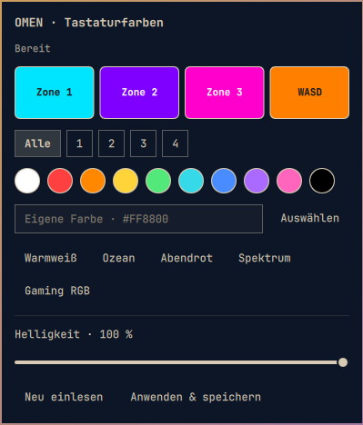

# OMEN Tastaturfarben für Omarchy

Vier RGB-Zonen aus der Omarchy-Leiste steuern: Farbpalette, eigene Hex-Farben,
Warmweiß, Ozean, Abendrot, Spektrum und Gaming RGB mit abgesetztem WASD-Bereich.



**Unterstützt: HP OMEN mit Board-ID `8C77` und Vier-Zonen-RGB-Tastatur.**
Der mitgelieferte Treiber lehnt andere Boards ab. Die vierte Zone steuert WASD
als gemeinsame Gruppe; das wurde am getesteten Laptop visuell bestätigt.
Es gibt keine Animationen und keine freie Farbwahl für jede einzelne Taste.
Die Oberfläche ist deutschsprachig.

**Manuelle Einrichtung erforderlich:** Die Store-Installation fügt nur das
Panel hinzu. Zum Ansteuern der Hardware muss der Zusatztreiber separat gebaut,
getestet und eingerichtet werden. Ohne ihn bleibt das Panel in der Vorschau.

## Voraussetzungen

- Omarchy 4 / Quattro mit Shell-Plugin-Unterstützung und Quickshell.
- Python 3 (nur Standardbibliothek), Git und die Omarchy-CLI für das Panel.
- Zum Treiberbau: C-Compiler, GNU Make, DKMS und Header für den laufenden Kernel.
- HP-Board `8C77`, HP-WMI-Schnittstelle und Vier-Zonen-RGB-Hardware.
- Ein lokaler Desktop-Benutzer. Die Einrichtung vergibt Schreibzugriff an genau
  diesen Benutzer. Der Startdienst verwendet dessen `~/.local/state`.

Board und Kernel prüfen:

```sh
cat /sys/class/dmi/id/board_name
uname -r
```

Auf Arch mit dem Standardkernel liefert `linux-headers` die Kernelheader:

```sh
sudo pacman -S --needed base-devel dkms linux-headers
```

Bei einem anderen Kernel das passende Headerpaket verwenden, beispielsweise
`linux-lts-headers` für `linux-lts`.

## Panel installieren

```sh
omarchy plugin add https://github.com/pepler1993-dot/omarchy-omen-rgb --enable
```

Omarchy fragt vor Installation und Aktivierung nach. Bereits installiert:

```sh
omarchy plugin update kevin.omen-rgb
```

Für lokale Entwicklung gibt es zusätzlich `python3 install-panel.py`. Dieser
Befehl kopiert die UI-Dateien in das Benutzer-Pluginverzeichnis und ergänzt das
Widget in `shell.json`; vor der Layoutänderung wird eine Sicherung erstellt.
Für die Store-Installation ist dieses Hilfsskript nicht erforderlich.

## Treiber manuell einrichten

Die folgenden Befehle bewusst in einem Terminal ausführen. Das Panel selbst
lädt keinen Treiber, installiert nichts und startet keine Rootprozesse.
Der vorhandene `hp_wmi`- oder `hp_bioscfg`-Treiber wird nicht ersetzt.

Im installierten Pluginverzeichnis bauen und den temporären Hardwaretest
starten. Bei einem bereits geladenen `omen_rgb` entfällt `insmod`:

```sh
cd ~/.config/omarchy/plugins/kevin.omen-rgb
make -C driver
sudo insmod driver/omen_rgb.ko
sudo python3 hardware-test.py
```

Der Test schreibt für zwei Sekunden vier Farben, liest sie zurück und stellt
im `finally`-Block die unmittelbar zuvor gelesenen Farben wieder her. Er ändert
kein dauerhaftes Benutzerprofil. Bei einem Fehler die dauerhafte Einrichtung
nicht fortsetzen. Ein nur temporär geladenes Modul lässt sich mit
`sudo rmmod omen_rgb` wieder entladen.

Anschließend den Startdienst zunächst ohne Änderungen anzeigen:

```sh
python3 install-driver.py --user "$(id -un)" --dry-run
```

Nach erfolgreichem Hardwaretest dauerhaft installieren:

```sh
sudo python3 install-driver.py --user "$(id -un)"
```

Dabei werden gezielt diese Bestandteile eingerichtet:

- DKMS-Quellcode und Lizenz unter `/usr/src/kevin-omen-rgb-0.4/`.
- Kernelmodul `omen_rgb` für den laufenden Kernel; DKMS baut bei Kernelupdates neu.
- Automatisches Laden über `/etc/modules-load.d/kevin-omen-rgb.conf`.
- Root-eigene Kopie des Python-Adapters unter `/usr/lib/kevin-omen-rgb/rgb.py`.
- `/etc/systemd/system/omen-rgb-restore.service` für den ausgewählten Benutzer.

Vor dem Überschreiben bestehender Zieldateien legt der Installer datierte
`.bak.*`-Sicherungen daneben an. Er kann für denselben Benutzer erneut aufgerufen
werden, um den Adapter und Dienst nach einem Update zu aktualisieren.

Der Dienst gibt ausschließlich die RGB-sysfs-Datei für diesen Benutzer frei
und führt die Profilwiederherstellung danach mit dessen Benutzerrechten aus.
Ohne gespeichertes Profil bleiben die Hardwarefarben erhalten. Der Startdienst
benötigt ein beim Systemstart verfügbares Home-Verzeichnis. Benutzerdefinierte
`XDG_STATE_HOME`-Pfade werden vom Installer derzeit nicht übernommen.

## Bedienung

Das Tastatursymbol in der Leiste öffnet das Panel. „Alle“ oder eine Zone wählen,
eine Farbe anklicken oder einen Hex-Code eingeben. Vorlagen zeigen zunächst nur
eine Vorschau. **„Anwenden & speichern“** schreibt die Farben und speichert das
Profil in `~/.local/state/omen-rgb/colors.json`. „Neu einlesen“ verwirft die
Vorschau und liest die Hardware. Fn+F4 bleibt die vorhandene Ein-/Aus-Steuerung.

**Gaming RGB:** Cyan `00E5FF`, Violett `8000FF`, Pink `FF00CC` und orange WASD
`FF8000`. Die Vorlage setzt die RGB-Helligkeit auf 100 %. Der Regler skaliert
die RGB-Komponenten; er steuert keinen separat nachgewiesenen Hardware-Dimmer.
Bei 0 % bleiben die Ausgangsfarben im gespeicherten Profil erhalten.

Nach manuellem Entladen und Laden des Treibers Schreibzugriff und Profil erneut
herstellen:

```sh
sudo systemctl restart omen-rgb-restore.service
```

Falls das Panel nach einem Update noch alte Inhalte zeigt:

```sh
omarchy restart shell
```

## Entfernen

Wenn der Treiber dauerhaft eingerichtet wurde, zuerst den Dienst und Treiber
entfernen. Bei einer reinen Panel-Installation diesen Block überspringen:

```sh
sudo systemctl disable --now omen-rgb-restore.service
sudo rm /etc/systemd/system/omen-rgb-restore.service
sudo rm /etc/modules-load.d/kevin-omen-rgb.conf
sudo systemctl daemon-reload
sudo modprobe -r omen_rgb
sudo dkms remove -m kevin-omen-rgb -v 0.4 --all
sudo rm /usr/lib/kevin-omen-rgb/rgb.py
```

Dann das Panel entfernen:

```sh
omarchy plugin remove kevin.omen-rgb
```

Das Farbprofil, datierte Sicherungen und gegebenenfalls verbleibende
DKMS-Quelldateien werden nicht automatisch gelöscht. Andere Plugins und
HP-Treiber bleiben erhalten.

## Prüfung und Grenzen

```sh
python3 -m unittest -v
omarchy plugin validate .
python3 rgb.py status
```

Die ursprüngliche Treiberversion wurde auf Board `8C77` mit Linux
`7.1.9-arch1-2` geprüft: Vier-Zonen-Lesen, Schreiben, Rücklesen, Wiederherstellung,
DKMS und Neuladen. WASD-Zuordnung und Panel wurden am Laptop bestätigt.
Ein vollständiger Boot-Test und ein Langzeittest sind nicht erfolgt.
Die verallgemeinerte Installation in Version 1.1.0 wurde über Tests und eine
Dienstvorschau geprüft; sie wurde nicht erneut auf dem laufenden System installiert.
Die historische lokale Testchronik steht in [VERIFICATION.md](VERIFICATION.md).

Optionaler Integrationstest nach eigener Installation und gespeichertem Profil:

```sh
sudo python3 verify-installation.py --user "$(id -un)"
```

Dieser Test lädt das Modul neu, ändert kurz eine Farbe und startet den
Wiederherstellungsdienst. Er ist kein normaler Unit-Test.

## Herkunft und Lizenz

GPL-2.0-only, siehe [LICENSE](LICENSE). Der Referenztreiber ist aus
[Alez22/omenkey](https://github.com/Alez22/omenkey), abgerufen am 2026-09-05;
die unveränderte Referenz liegt in `vendor/omen_rgb.c`. Protokollursprung:
[pelrun/hp-omen-linux-module](https://github.com/pelrun/hp-omen-linux-module).

Lokale Anpassungen: initialisierte Anfragepuffer, Prüfung von ACPI-Status,
Antworttyp und Antwortlänge, Ablehnung verkürzter Farbzustände, Begrenzung auf
Board `8C77` und ein gemeinsames `colors`-Attribut für atomare Vier-Zonen-Updates.
Nicht bestätigte Helligkeitsbefehle werden nicht verwendet. Nur nach
bestätigtem Rücklesen speichert der Python-Adapter das Profil.

Die [Zonenbelegung von omenctl](https://github.com/SwarritSrivastava/omenctl#zone-map)
war die Referenz für die anschließend lokal bestätigte WASD-Zuordnung.
